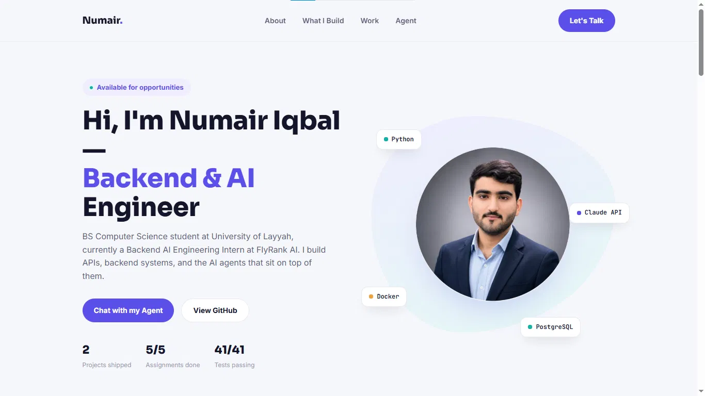
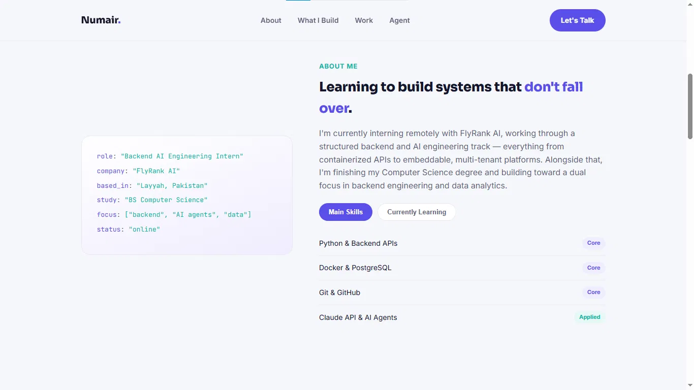
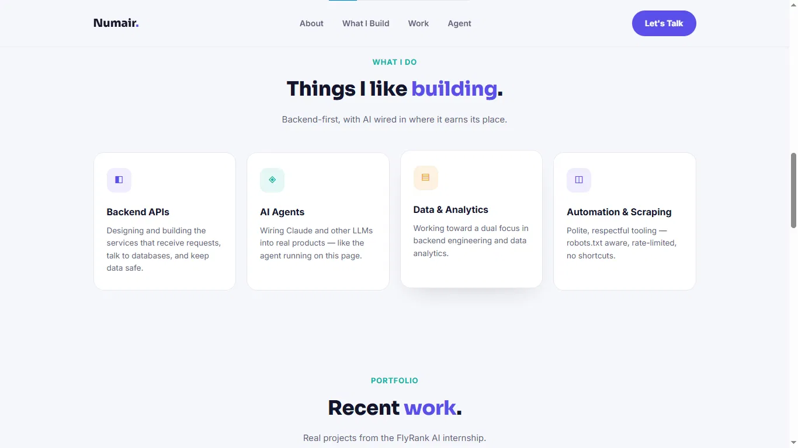
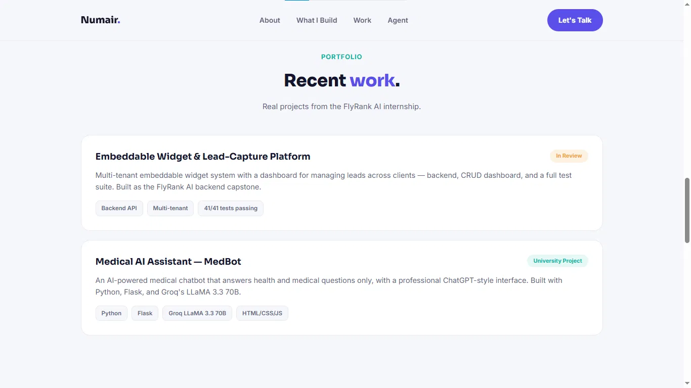
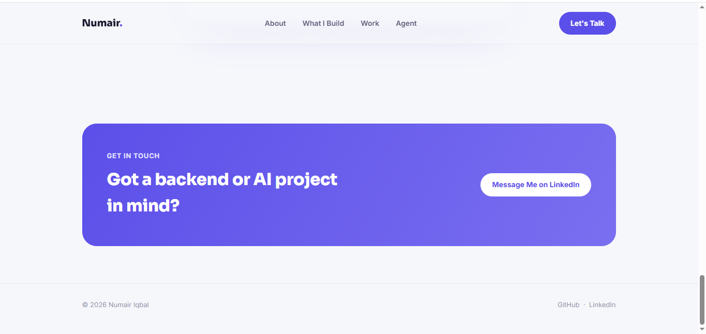
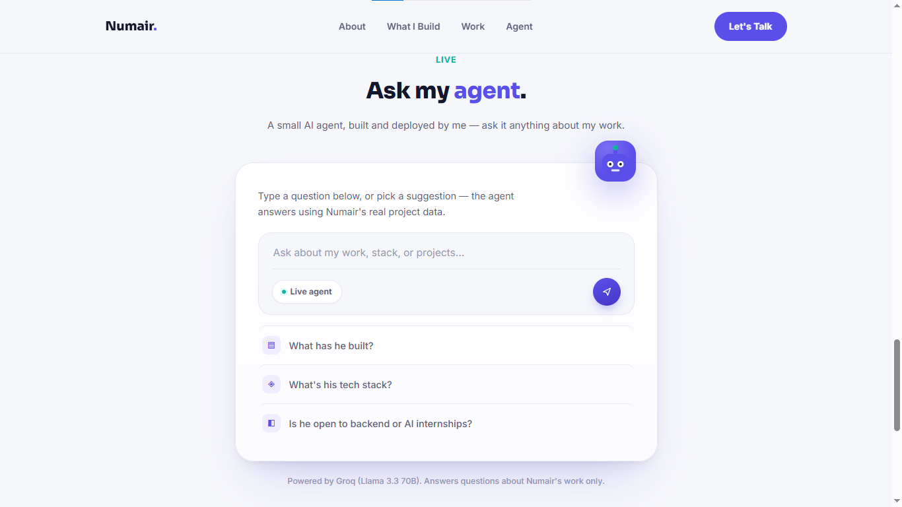
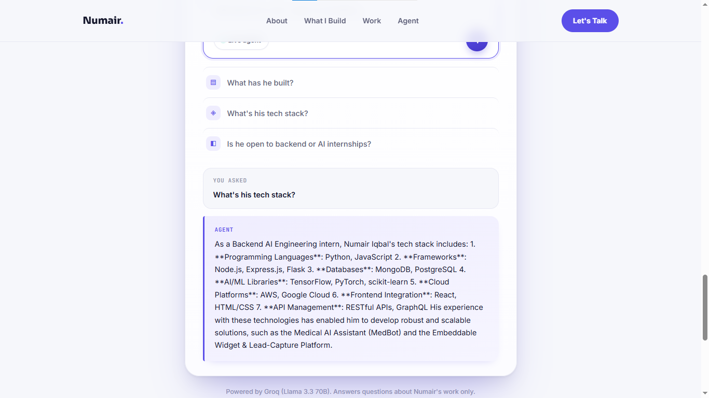
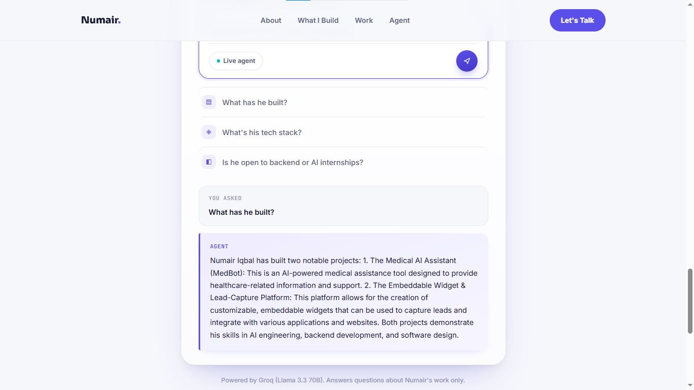
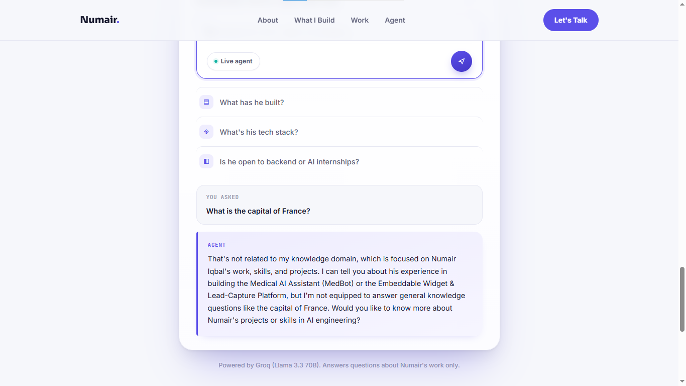

<div align="center">

# Numair Iqbal — Portfolio & Live AI Agent

### Backend & AI Engineer · Personal brand website with a real, working AI agent shipped on it

<p>
  
  
  
</p>

<p>
  
  
  
  
  
  
</p>

**[🔗 Live Site](#)** &nbsp;·&nbsp; **[📬 Contact](#-contact)** &nbsp;·&nbsp; **[📂 GitHub](https://github.com/Numair-Iqbal)**

</div>

<br>

## 📌 Overview

This is my personal portfolio — built as the capstone project for FlyRank AI's **General AI Fluency · Impact Project**. It's not a template. It's a real, deployed website with a real, working AI agent embedded on the page, backed by a live serverless API.

The brief was simple: *master the AI stack, build a personal brand with a real website, ship a personal agent.* This repo is that, end to end — design, frontend, backend function, deployment.

<br>

## ✨ Features

<table>
<tr>
<td width="50%" valign="top">

### 🎨 Design
- Custom light-theme UI — no template, no page builder
- Indigo & teal accent palette, Sora + Inter typography
- Fully responsive — mobile, tablet, desktop
- Smooth hover states, floating skill-chip animation

</td>
<td width="50%" valign="top">

### 🤖 Live AI Agent
- Real conversational agent, not a mock chatbot
- Powered by **Groq's LLaMA 3.3 70B**
- Fixed system prompt — only answers questions about my work
- Rate-limited to prevent abuse

</td>
</tr>
<tr>
<td width="50%" valign="top">

### 🧱 Architecture
- Static frontend + Vercel serverless function
- API key never exposed client-side (server-only env var)
- Clean separation: `index.html` / `style.css` / `agent.js`

</td>
<td width="50%" valign="top">

### 🔒 Security & Reliability
- `.env.local` gitignored — secrets never committed
- Input validation (empty / oversized requests rejected)
- Per-visitor request throttling on the API route

</td>
</tr>
</table>

<br>

## 🛠️ Tech Stack

<div align="center">

| Layer | Technology |
|:---|:---|
| **Frontend** | HTML5 · CSS3 · Vanilla JavaScript (ES6) |
| **Fonts** | Sora (display) · Inter (body) · JetBrains Mono (code accents) |
| **Backend** | Vercel Serverless Functions (Node.js) |
| **AI Model** | Groq API — `llama-3.3-70b-versatile` |
| **Hosting** | Vercel |
| **Version Control** | Git & GitHub |

</div>

<br>

## 📸 Screenshots

### 🖥️ Website Walkthrough

<div align="center">

<table>
<tr>
<td align="center" width="33%"><b>Hero Section</b></td>
<td align="center" width="33%"><b>About</b></td>
<td align="center" width="33%"><b>What I Build</b></td>
</tr>
<tr>
<td align="center"></td>
<td align="center"></td>
<td align="center"></td>
</tr>
<tr>
<td align="center"><sub>Intro, role, live status badge, floating skill chips</sub></td>
<td align="center"><sub>Bio with tabbed skills — Main Skills / Currently Learning</sub></td>
<td align="center"><sub>Backend APIs · AI Agents · Data · Automation</sub></td>
</tr>
</table>

<table>
<tr>
<td align="center" width="50%"><b>Portfolio</b></td>
<td align="center" width="50%"><b>Contact & Footer</b></td>
</tr>
<tr>
<td align="center"></td>
<td align="center"></td>
</tr>
<tr>
<td align="center"><sub>Real projects — FlyRank capstone & MedBot</sub></td>
<td align="center"><sub>Get-in-touch panel and footer links</sub></td>
</tr>
</table>

</div>

<br>

### 🤖 Live Agent — Behaviour Tests

All four states below were captured from the deployed agent, not mocked. Screenshots confirm each response.

<table>
<tr>
<td width="50%" valign="top">

**💤 Idle State**

`Agent` → renders with no request sent

Default state before a visitor has typed anything — suggested questions ready to click.



</td>
<td width="50%" valign="top">

**🧠 Tech Stack Question**

`Agent` → *"What's his tech stack?"*

Answers correctly from the fixed system prompt, without inventing tools I don't use.



</td>
</tr>
<tr>
<td width="50%" valign="top">

**💼 Work Question**

`Agent` → *"What has Numair built?"*

Correctly summarizes real projects — the FlyRank capstone and MedBot.



</td>
<td width="50%" valign="top">

**🔒 Safety Guardrail**

`Agent` → off-topic question

Politely declines and redirects — the system prompt keeps it scoped to my work only.



</td>
</tr>
</table>

<br>

## 📂 Project Structure

```
numair-portfolio/
├── public/
│   ├── index.html          → Page markup
│   └── style.css           → All styling
├── api/
│   └── agent.js             → Serverless function — connects the chat box to Groq
├── screenshots/             → README preview images
├── .env.example              → Template for the required API key
├── .gitignore
├── package.json
└── README.md
```

<br>

## 🚀 Getting Started

<table>
<tr><td width="40px" align="center"><b>1</b></td><td>

Clone the repo
```bash
git clone https://github.com/Numair-Iqbal/numair-portfolio.git
cd numair-portfolio
```

</td></tr>
<tr><td align="center"><b>2</b></td><td>

Add your Groq API key
```bash
cp .env.example .env.local
# then paste your key into .env.local
```

</td></tr>
<tr><td align="center"><b>3</b></td><td>

Run locally with Vercel
```bash
npm install -g vercel
vercel dev
```

</td></tr>
<tr><td align="center"><b>4</b></td><td>

Open **http://localhost:3000** and try the live agent

</td></tr>
</table>

<br>

## ☁️ Deployment

Deployed on **Vercel** — push to `main`, import the repo on [vercel.com](https://vercel.com), add `GROQ_API_KEY` under **Settings → Environment Variables**, and deploy. No build step required.

<br>

## 📬 Contact

<div align="center">

**Numair Iqbal**
Backend AI Engineering Intern @ FlyRank AI · BS Computer Science, University of Layyah

<a href="https://github.com/Numair-Iqbal"></a>
<a href="#"></a>

</div>

<br>

<div align="center">
<sub>Built as the capstone for FlyRank AI's General AI Fluency · Impact Project — © 2026 Numair Iqbal</sub>
</div>
